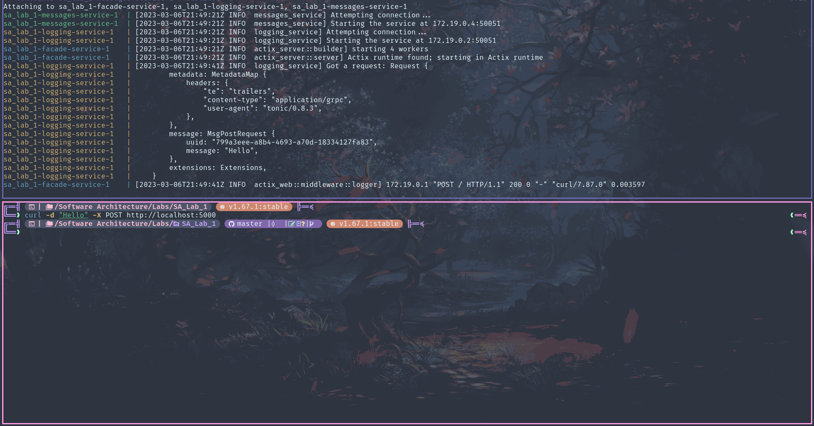
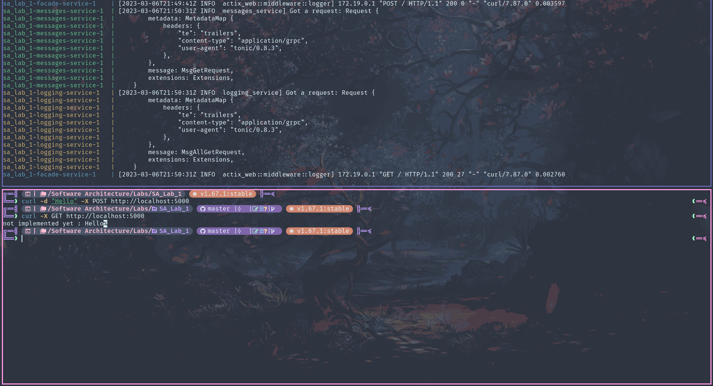
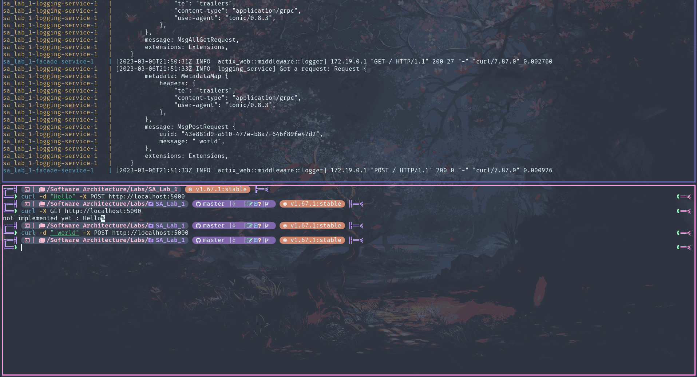
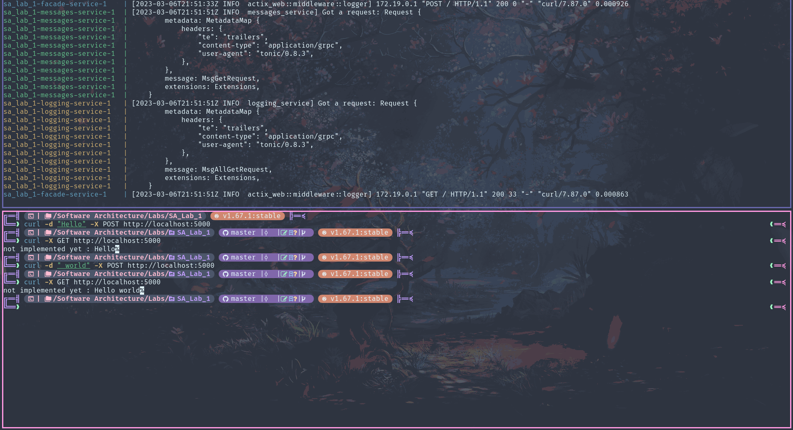
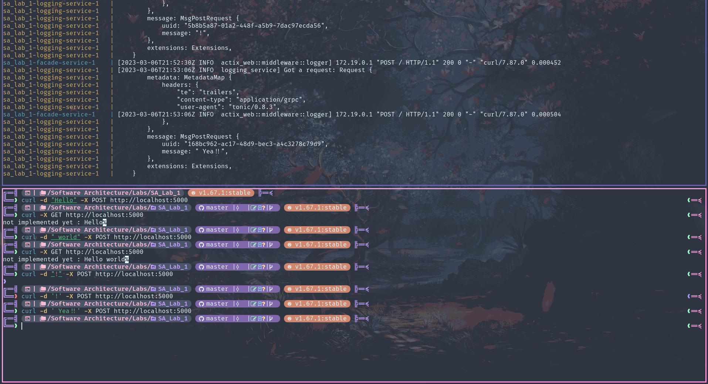
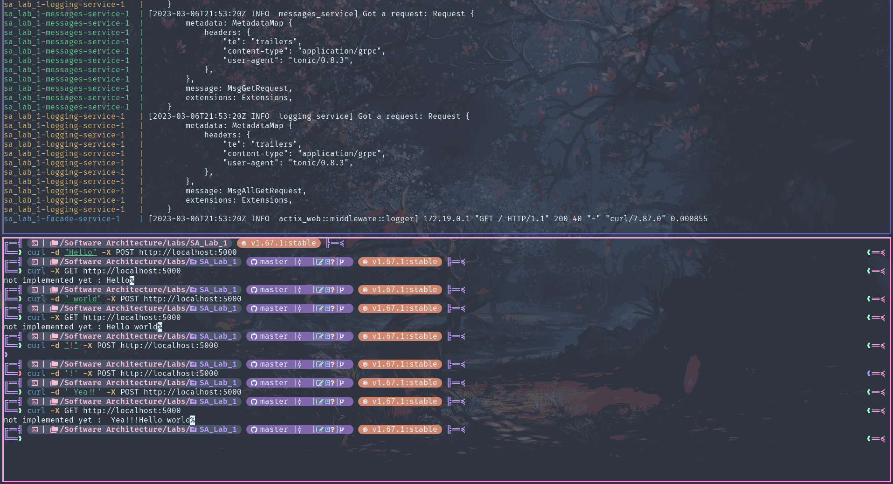

# [Lab 1: Microservices' Basics](https://github.com/oleksandr-sobkovych/software-architecture-labs)
   Authors: [Oleksandr Sobkovych](https://github.com/oleksandr-sobkovych)
## Prerequisites

- docker compose
- curl or another http client

## Usage

Setup variables in the .env file:

```bash
MESSAGES_SERVICE_PORT=50051
LOGGING_SERVICE_PORT=50051
# Both inner and outer
FACADE_SERVICE_PORT=5000
RUST_LOG=info
```

Build and run containers:

```bash
docker-compose up --build
```

Send GET and POST requests to the facade-service:

```bash
curl -X GET http://localhost:5000
curl -d "Hello" -X POST http://localhost:5000
```

## Examples











Since messages are stored in a HashMap, the order can be "random": depends on random UUIDs.


